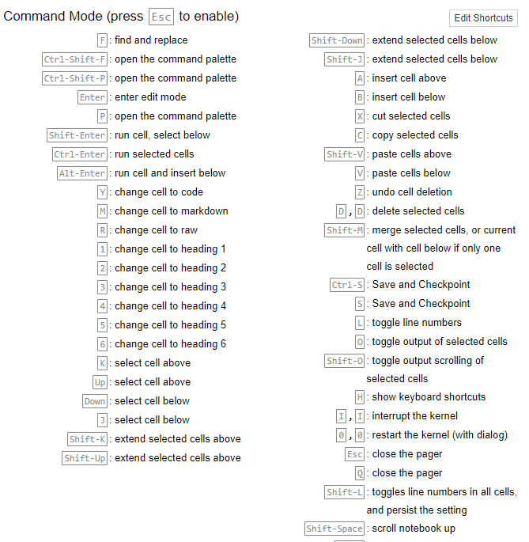
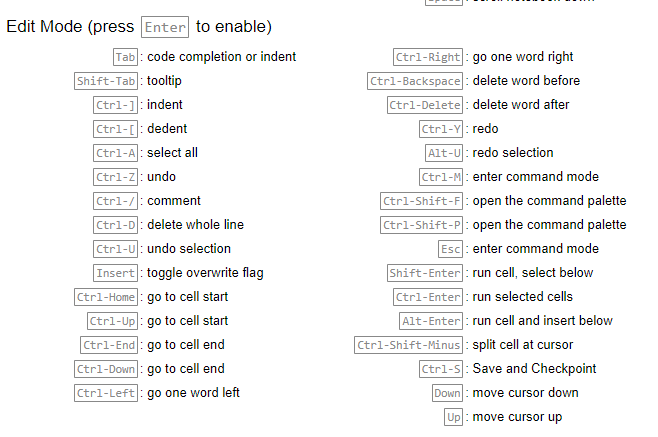
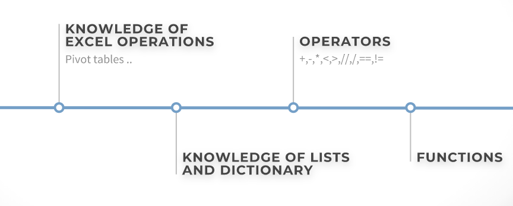

# data_analysis_pandas

To ensure faster execution do esc and h for help for keyboard short cuts 

1> Command Mode Shortcuts

2> Edit Mode Shortcuts 

Prereq:

Series: 

Documentation https://pandas.pydata.org/pandas-docs/stable/reference/api/pandas.Series.html

Workbook:  https://github.com/naashonomics/data_analysis_pandas/blob/master/Series.ipynb

CSV file 

          1: https://github.com/naashonomics/data_analysis_pandas/blob/master/pokemon.csv 

          2: https://github.com/naashonomics/data_analysis_pandas/blob/master/google_stock_price.csv

Dataframe:

Workbook1:https://github.com/naashonomics/data_analysis_pandas/blob/master/DataFrames%201.ipynb

Workbook2:https://github.com/naashonomics/data_analysis_pandas/blob/master/DataFrames%202.ipynb

Workbook3:https://github.com/naashonomics/data_analysis_pandas/blob/master/DataFrames%203.ipynb
